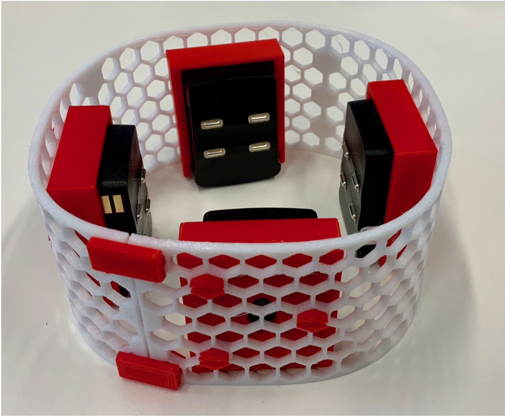
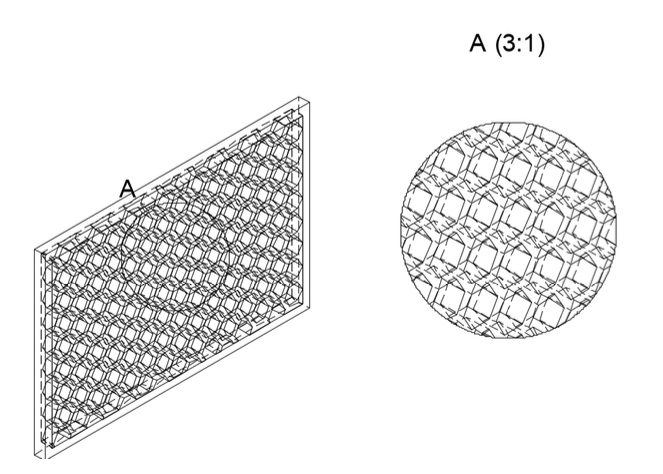
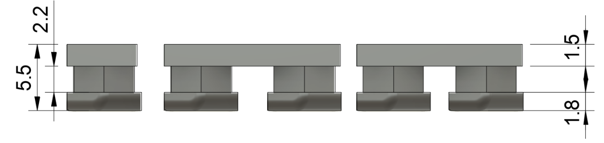
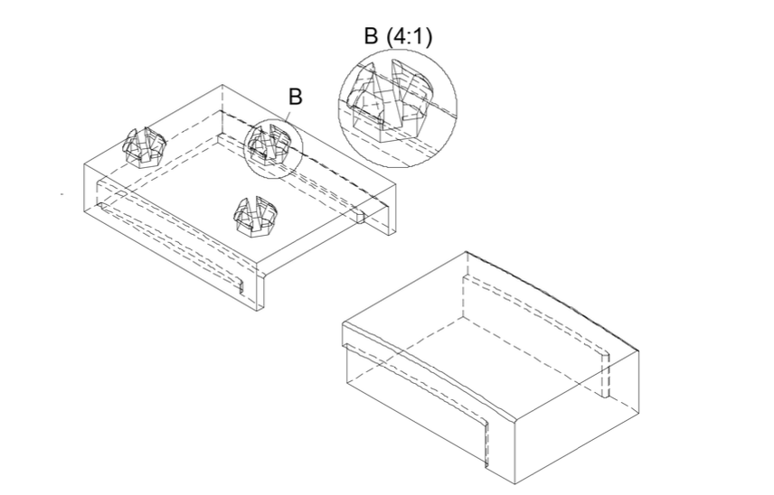
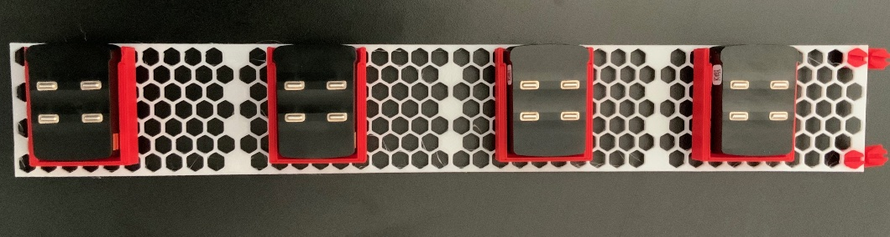

# Development of a flexible, modular, and wearable 3D printed sensor system

## Project Overview
This repository present the results of the development of a flexible, modular and wearable 3D printed sensor system for the Delsys Inc. Avanti sensors [1] in the scope of the Research Lab of Enes Bektürk at Assistive Intelligent Robotics Lab, AIBE, FAU. The project was supervised by Marc-Anton Scheidl and Fabio Egle.
The goal was to utilize 3D printing technology to create a versatile, adaptable and wearable sensor system. The primary focus is on developing a system that can accommodate EMG sensors for wearable robotics applications while also being capable of integrating other sensor types. The aim is to produce a sensor system that is both flexible and modular, allowing for easy customization and scalability to meet various research and industry needs. The stated objective of this Research Lab was:
* Acquisition of Electromyography (EMG)-Data in a multi-channel configuration
* Secure and strong fit of multiple Delsys Inc. Avanti sensors [8]
* Modular and / or stretchable design to house a variable number of sensors
* Wearable below and above the elbow and below and above the knee!
* No usage of adhesive materials
* Strong fit to dedicated extremities during activities of daily living
* Simple and easy donning and doffing
* Minimum assembly required
* Comfortable fit

In the scope of this work previous scientific work has been investigated including [2], [3]. While both solutions have there advantages for certain use cases, none could satisfy all stated objectives.

## Results

*Picture of the closed sensorband with sensors attached**

### Hexagon Band

*CAD construction of hexagon structured band*

Due to the requirements, choosing TPU as the base material was the most suitable option. Furthermore, the hexagonal structure was selected based on the requirements, as it was best suited to withstand the forces acting on the band. To adjust the band to various anatomical structures with different diameters, different band lengths were used. As the overall length was limited by the 3D printer, the max- imum printing length of the printer was divided by four to serve as the base length for the band. This base length was then mirrored and multiplied to create the band for the sensor holder. By using this method, different band lengths could be easily adjusted to fit a wide range of anatomical structures.

### Wristband Closure

*Technical illustration of the different types of Mounting Brackets for (left to right) vertically connecting two bands, connecting four bands or 2 row end-to-end at the corner of each band end, horizontal connecting of two bands*

Various Mounting brackets/ holders were designed to fulfill different functions and had different geometric arrangements. Differ- ent Holders were needed to fulfill following functions (see also Figure 2):
1. Housing-band attachement: To attach the Sensor Housing to the band.
2. Extending the band-length: Holders that serve to extend the band be-
tween the bands.
3. Connect Sensor Rows: Holders that vertically connect a possible second row of sensors on a separate band.
4. Wristband closure: A Mounting Bracket that connects the end of one band with the underlying band.

### Sensor Housing

*CAD Construction of Sensor Holder and the Sensor*

*Picture of the open Sensorband with Sensors attached*

Unlike the band and the holder, the Sensor Holder is subject to minimal forces during movement, and therefore, no special elasticity is required. The main requirement is that the sensor remains stable in its anchorage throughout the process. Therefore PLA is used for the Sensor Holder.

# References
[1] Trigno Avanti Technical Specifications. https://delsys.com/trigno-avanti/#techspecs. Accessed on June 3, 2023. Delsys Inc., Accessed 2023.

[2] Ulysse Côté-Allard et al. “A Low-Cost, Wireless, 3-D-Printed Custom Armband for sEMG Hand Gesture Recognition”. In: Sensors 19.12 (Jan. 2019). Number: 12 Publisher: Multidisciplinary Digital Publishing Institute, p. 2811. ISSN: 1424-8220. DOI: 10.3390/s19122811. URL: https://www.mdpi.com/1424-8220/19/12/2811 (visited on 11/27/2022).

[3] Manuela Gomez-Correa and David Cruz-Ortiz. “Low-Cost Wearable Band Sen- sors of Surface Electromyography for Detecting Hand Movements”. eng. In: Sen- sors (Basel, Switzerland) 22.16 (Aug. 2022), p. 5931. ISSN: 1424-8220. DOI: 10. 3390/s22165931.